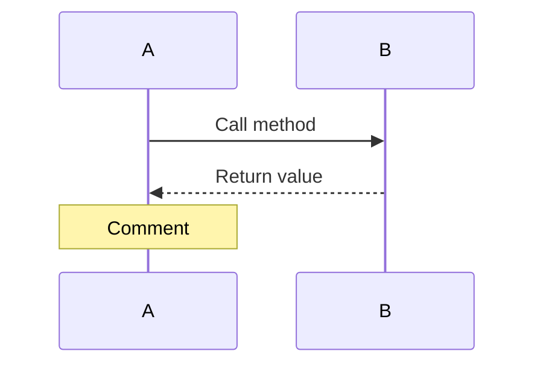
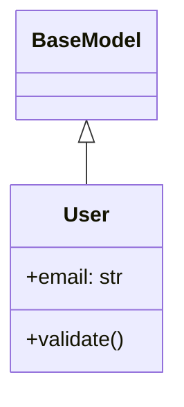
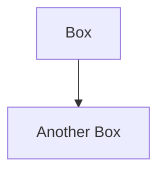

# HBnB Part 1 - UML Diagrams Index

## 📋 Quick Navigation

### Architecture Diagrams

#### 1️⃣ [Package Diagram](1-package-diagram.mmd)
**Shows:** 3-layer architecture (Presentation, Business Logic, Persistence) with Facade pattern

**Use this to understand:**
- Overall project structure
- How layers communicate
- Where Facade fits in

**View this first!** ⭐

---

#### 2️⃣ [Class Diagram](2-class-diagram.mmd)
**Shows:** All models, their attributes, methods, and relationships

**Use this to understand:**
- Entity structure (User, Place, Review, Amenity)
- Inheritance (BaseModel → concrete models)
- Relationships (User owns Places, Reviews link Users and Places)
- Repository and Facade classes

**View this second!** ⭐

---

### Sequence Diagrams (API Flows)

#### 3️⃣ [Create Place](3-sequence-create-place.mmd)
**Flow:** `POST /api/v1/places`

**Shows:**
- Multi-step validation (owner exists, amenities exist)
- Model creation and validation
- Repository storage
- Extended response with nested data

**Complexity:** 🔴 High

---

#### 4️⃣ [Get Place Reviews](4-sequence-get-place-reviews.mmd)
**Flow:** `GET /api/v1/reviews/place/{place_id}`

**Shows:**
- Simple query with filtering
- Using repository predicates

**Complexity:** 🟢 Low

---

#### 5️⃣ [Create User](5-sequence-create-user.mmd)
**Flow:** `POST /api/v1/users`

**Shows:**
- Duplicate email detection
- Model validation
- Password exclusion from response
- Error handling (409 Conflict)

**Complexity:** 🟡 Medium

---

#### 6️⃣ [Update Place](6-sequence-update-place.mmd)
**Flow:** `PUT /api/v1/places/{place_id}`

**Shows:**
- Partial update logic
- Conditional validation (only validate changed fields)
- Timestamp update
- Extended response

**Complexity:** 🔴 High

---

#### 7️⃣ [Delete Review](7-sequence-delete-review.mmd)
**Flow:** `DELETE /api/v1/reviews/{review_id}`

**Shows:**
- Simple delete operation
- 404 handling
- 204 No Content response

**Complexity:** 🟢 Low

---

## 🎯 Learning Path

### For Beginners:
1. Package Diagram → understand structure
2. Class Diagram → understand entities
3. Create User → simple flow
4. Get Place Reviews → simple query
5. Delete Review → simple delete

### For Understanding Complex Operations:
1. Create Place → validation chains
2. Update Place → partial updates with validation

---

## 🔍 Use Cases

### "I want to understand..."

| What | Diagram(s) |
|------|-----------|
| Overall architecture | 1-package-diagram |
| Entity relationships | 2-class-diagram |
| How to create entities | 3, 5 (create-place, create-user) |
| How validation works | 3, 5, 6 (any create/update) |
| How updates work | 6-update-place |
| How deletes work | 7-delete-review |
| Error handling | 5, 6 (create-user, update-place) |
| Extended attributes | 3, 6 (place operations) |
| Repository usage | All sequence diagrams |
| Facade pattern | All diagrams |

---

## 📊 Diagram Statistics

| Diagram | Type | Entities Shown | Complexity |
|---------|------|----------------|------------|
| Package | Structure | All layers | Low |
| Class | Structure | All models | Medium |
| Create Place | Behavior | Place, User, Amenity | High |
| Get Reviews | Behavior | Review | Low |
| Create User | Behavior | User | Medium |
| Update Place | Behavior | Place, User, Amenity | High |
| Delete Review | Behavior | Review | Low |

---

## 💡 Key Concepts by Diagram

### Package Diagram
- **Layered Architecture**
- **Facade Pattern**
- **Separation of Concerns**

### Class Diagram
- **Inheritance** (BaseModel)
- **Composition** (Place has amenities)
- **Associations** (Review → User, Review → Place)
- **Repository Pattern**

### Sequence Diagrams
- **Request/Response Flow**
- **Validation Chains**
- **Error Handling**
- **Repository Operations**
- **Extended Attributes**

---

## 🚀 How to Use These Diagrams

### For Development:
1. **Before coding** → Study relevant sequence diagram
2. **During coding** → Reference class diagram for attributes
3. **For debugging** → Trace flow in sequence diagram
4. **For testing** → Use flows to design test cases

### For Documentation:
1. **In README** → Embed package and class diagrams
2. **In API docs** → Link to sequence diagrams for complex operations
3. **In presentations** → Use package diagram for overview

### For Learning:
1. **Start with package diagram** → big picture
2. **Study class diagram** → entities and relationships
3. **Follow one complete flow** → pick a sequence diagram
4. **Compare code with diagram** → verify implementation

---

## 🛠️ Tools for Viewing

### Quick View (No Installation):
1. Go to https://mermaid.live/
2. Copy content from `.mmd` file
3. Paste and view

### VS Code:
Install extension: "Markdown Preview Mermaid Support"

### GitHub/GitLab:
Diagrams render automatically when you push

### Generate Images:
```bash
# Install mermaid-cli
npm install -g @mermaid-js/mermaid-cli

# Generate PNG
mmdc -i 1-package-diagram.mmd -o package-diagram.png

# Generate all
for f in *.mmd; do mmdc -i "$f" -o "${f%.mmd}.png"; done
```

---

## 📝 Mermaid Syntax Quick Reference

### Sequence Diagram:


### Class Diagram:


### Graph/Package Diagram:


---

## 🔗 Related Documentation

- **Full Guide:** [UML-DIAGRAMS-README.md](UML-DIAGRAMS-README.md)
- **Implementation:** See `../part2/` directory
- **Project Requirements:** Check course curriculum

---

## ✅ Checklist for Understanding

- [ ] I can explain the 3-layer architecture
- [ ] I understand the Facade pattern
- [ ] I know all entity relationships
- [ ] I can trace a complete API request flow
- [ ] I understand validation chains
- [ ] I know where each error code is returned
- [ ] I can explain extended attributes (Place with owner/amenities)
- [ ] I understand the Repository pattern

---

## 📮 Questions to Test Understanding

1. **What layer handles HTTP requests?** (Answer: Presentation/API)
2. **Where does validation happen?** (Answer: In models, via validate() method)
3. **What does the Facade do?** (Answer: Simplifies access to business logic)
4. **Which entity has DELETE operation?** (Answer: Review only)
5. **What's the difference between owner_id and owner?** (Answer: owner_id is stored, owner is expanded in response)
6. **When is 409 returned?** (Answer: Duplicate email - future feature)
7. **What does touch() do?** (Answer: Updates the updated_at timestamp)
8. **Why is password removed from responses?** (Answer: Security - sensitive data)

---

Happy learning! 🎓
